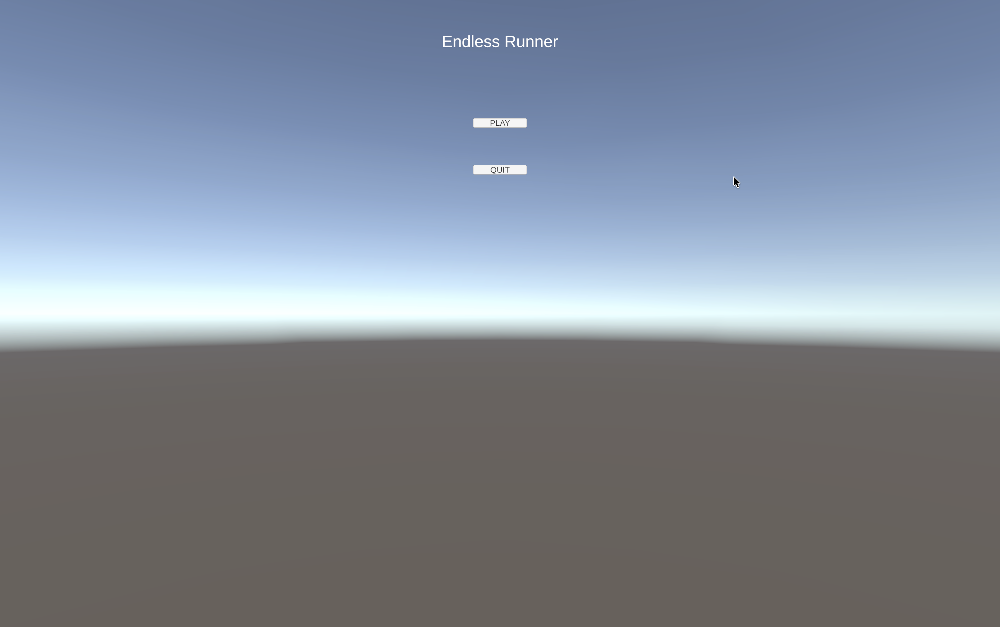
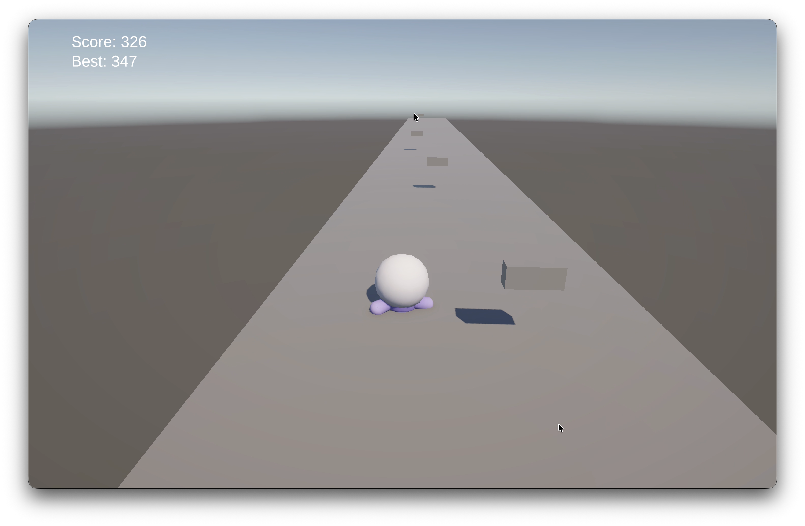
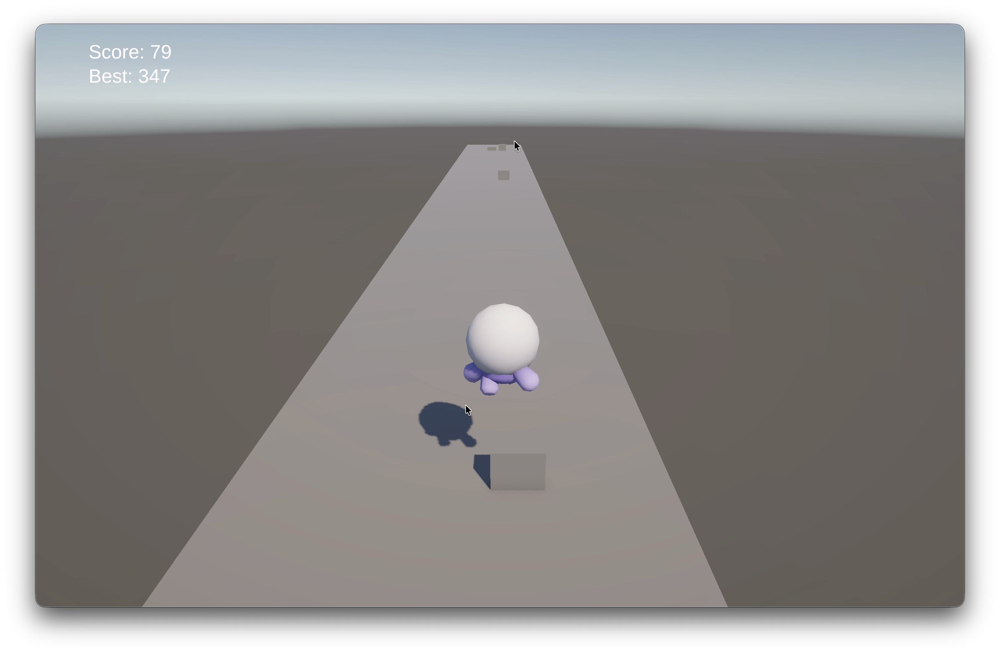
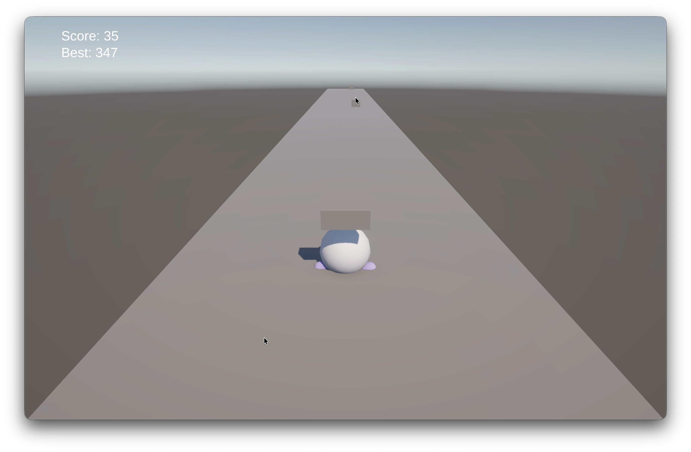
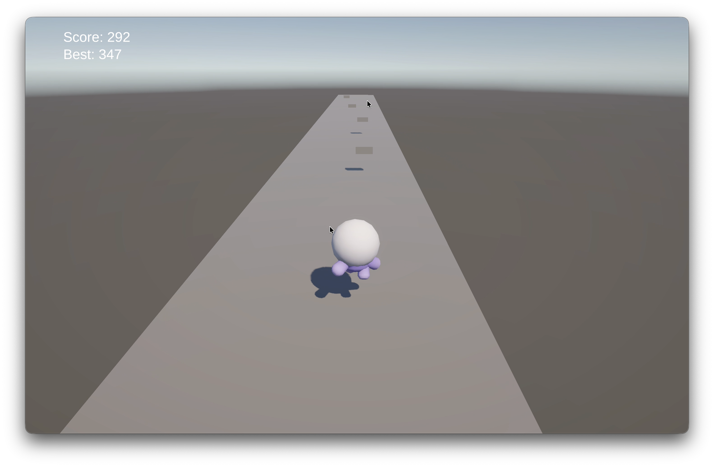
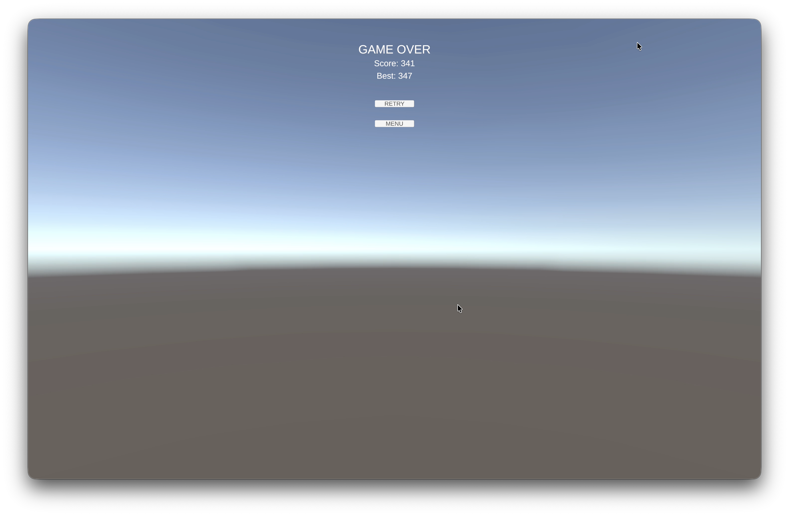

<h1 align="center">Endless Runner 3D — Unity Endless Runner Game</h1>

<p align="center">
  
  <a href="https://twitter.com/yandevv_" target="_blank">
    
  </a>
</p>

<p align="center">
  Endless Runner 3D is a game built with Unity where the player runs forward automatically, dodges obstacles, jumps over low barriers, slides under high barriers, and tries to survive as long as possible while the game gets faster over time.
</p>

<h5 align="center">Give a &#11088; if this project helped you or if you find it interesting!</h5>

---

## Table of Contents
- [Table of Contents](#table-of-contents)
- [About](#about)
  - [How It Works](#how-it-works)
  - [Core Gameplay Loop](#core-gameplay-loop)
- [Gameplay Video](#gameplay-video)
- [Screenshots](#screenshots)
  - [Main Menu](#main-menu)
  - [Gameplay - Running and Obstacles](#gameplay---running-and-obstacles)
  - [Gameplay - Jump / Slide Moment](#gameplay---jump--slide-moment)
    - [Jumping an obstacle](#jumping-an-obstacle)
    - [Crouching through an obstacle](#crouching-through-an-obstacle)
- [Controls](#controls)
- [Features](#features)
  - [Current Features](#current-features)
- [Progressive Speed Scaling](#progressive-speed-scaling)
  - [Code](#code)
  - [Feature Screenshot](#feature-screenshot)
- [Feature 2: Persistent High Score](#feature-2-persistent-high-score)
  - [Code](#code-1)
  - [Feature Screenshot](#feature-screenshot-1)
- [How the Player Movement Works](#how-the-player-movement-works)
- [Scene Structure](#scene-structure)
- [Scripts Overview](#scripts-overview)
- [Getting Started](#getting-started)
  - [Prerequisites](#prerequisites)
  - [Running in Unity](#running-in-unity)
  - [Building the Game](#building-the-game)
- [Assets and Credits](#assets-and-credits)
- [About Me](#about-me)
- [License](#license)
- [What I Learned](#what-i-learned)

---

## About
**Endless Runner 3D** is an endless 3D running game developed in **Unity 3D**, mainly as an individual college assignment. The game follows the classic endless runner loop: the character runs forward automatically on an infinite track, while the player moves between lanes, jumps, and slides to avoid obstacles.

The objective is simple: **survive for as long as possible and beat your best score**.

### How It Works
1. The game starts from the `Menu` scene, with a Play button and looping background music.
2. The `Game` scene starts the endless runner loop.
3. The player moves forward automatically using the current speed from `SpeedScaler`.
4. Track tiles are recycled ahead of the player to simulate an infinite road.
5. Obstacles are spawned across three lanes.
6. The player can dodge, jump, or slide to avoid obstacles.
7. The run ends when the player collides with an obstacle.
8. The final score and best score are shown in the `GameOver` scene.

### Core Gameplay Loop
- **Automatic forward running** using Rigidbody movement.
- **Lane movement** with keyboard arrows, `A / D`, or gamepad left stick.
- **Jump** to clear low obstacles.
- **Slide / crouch** to pass under high obstacles.
- **Progressive difficulty** because speed increases over time.
- **Distance-based score** that grows while the player survives.
- **Persistent high score** saved with Unity `PlayerPrefs`.

<!-- ## Assignment Requirements
This README was written to satisfy the required assignment checklist:

- **Game name, description, and gameplay instructions** are documented in this README.
- **Gameplay video** section is included below.
- **At least 3 screenshots** are embedded below: 1 menu screenshot and 2 gameplay screenshots.
- **At least 2 developed features** are documented with explanation, embedded C# code, and screenshot placeholders:
  - Progressive speed scaling.
  - Persistent high score system.
- The project uses a Unity-specific `.gitignore` to keep the repository lighter and more professional.
- The game includes a menu with background music, functional gameplay, keyboard controls, and gamepad lane movement support.

> Before final submission, replace the placeholder image files and video link with the real gameplay captures. -->

---

## Gameplay Video
Watch the gameplay video here:

**YouTube:** https://youtu.be/_gQis9_LQGw

---

## Screenshots
### Main Menu


### Gameplay - Running and Obstacles


### Gameplay - Jump / Slide Moment
#### Jumping an obstacle


#### Crouching through an obstacle


---

## Controls
| Input                        | Action                              |
| ---------------------------- | ----------------------------------- |
| **A / D**                    | Move left / right between lanes     |
| **Left Arrow / Right Arrow** | Move left / right between lanes     |
| **Gamepad left stick**       | Move left / right between lanes     |
| **Space**                    | Jump over low obstacles             |
| **Left Ctrl**                | Slide / crouch under high obstacles |

---

## Features
### Current Features
- **Menu with background music** - The game starts from a menu scene with looping music and a Play button.
- **Automatic endless running** - The player constantly moves forward on the Z axis.
- **Jump and slide mechanics** - Low obstacles are avoided by jumping, and high obstacles are avoided by sliding.
- **Progressive speed scaling** - The longer the player survives, the faster the run becomes.
- **Distance-based scoring** - Score increases based on movement speed and survival time.
- **Persistent high score** - Best score is saved locally using `PlayerPrefs`.
- **Infinite track illusion** - Track tiles are recycled with an object pool instead of spawning unlimited new tiles.
- **Random obstacle spawning** - Obstacles are generated on recycled tiles across three lanes.

---

## Progressive Speed Scaling
One of developed features was the **progressive speed scaling system**.

As the player survives longer, `CurrentSpeed` increases from `baseSpeed` toward `maxSpeed` using a fixed acceleration value. The player movement reads `SpeedScaler.CurrentSpeed`, so the character moves faster over time and obstacles arrive more quickly. This creates a natural difficulty curve without needing fixed levels.

The speed is also reset in `Start()`, which guarantees that every new run begins at the base speed.

### Code
```csharp
using UnityEngine;

public class SpeedScaler : MonoBehaviour
{
    public float baseSpeed = 10f;
    public float maxSpeed = 30f;
    public float acceleration = 0.5f;
    public static float CurrentSpeed { get; private set; }

    void Start() => CurrentSpeed = baseSpeed; // reset on every load and reload

    void Update()
    {
        if (GameManager.Instance == null || !GameManager.Instance.IsPlaying) return;
        CurrentSpeed = Mathf.Min(CurrentSpeed + acceleration * Time.deltaTime, maxSpeed);
    }
}
```

### Feature Screenshot


---

## Feature 2: Persistent High Score
The second required developed feature is the **persistent high score system**.

The current score is based on distance traveled. Each frame, the game adds `SpeedScaler.CurrentSpeed * Time.deltaTime` to a float accumulator, then floors it into an integer for display. Keeping the accumulator as a float is important because small per-frame values could become zero if they were rounded too early.

When the player loses, `SaveHighScore()` checks if the current score is greater than the saved best score. If it is, the value is stored with `PlayerPrefs.SetInt()` and saved to disk with `PlayerPrefs.Save()`. This makes the best score persist even after closing and reopening the game.

### Code
```csharp
using UnityEngine;

public class ScoreManager : MonoBehaviour
{
    public static int CurrentScore { get; private set; }
    public static int HighScore => PlayerPrefs.GetInt("HighScore", 0);

    private static float scoreAccumulator;

    void Start()
    {
        // Reset the statics on every load and reload
        CurrentScore = 0;
        scoreAccumulator = 0f;

        if (UIManager.Instance != null)
            UIManager.Instance.UpdateHighScore(HighScore);
    }

    void Update()
    {
        if (GameManager.Instance == null || !GameManager.Instance.IsPlaying) return;

        // Accumulate as float (= distance traveled), floor for the int display
        scoreAccumulator += SpeedScaler.CurrentSpeed * Time.deltaTime;
        CurrentScore = Mathf.FloorToInt(scoreAccumulator);

        if (UIManager.Instance != null)
            UIManager.Instance.UpdateScore(CurrentScore);
    }

    public static void SaveHighScore()
    {
        if (CurrentScore > HighScore)
        {
            PlayerPrefs.SetInt("HighScore", CurrentScore);
            PlayerPrefs.Save(); // force write to disk now
        }
    }
}
```

### Feature Screenshot


---

## How the Player Movement Works
The player movement is Rigidbody-based. The script controls forward movement on the Z axis using `SpeedScaler.CurrentSpeed`, horizontal movement on the X axis using keyboard or gamepad input, and leaves Y movement to Unity physics for gravity and jumping.

The slide mechanic changes only the `CapsuleCollider` height and center. This lets the player pass under high obstacles without scaling the character model. The visual slide is handled through the Animator using the `IsSliding` boolean.

```csharp
void FixedUpdate()
{
    if (GameManager.Instance == null || !GameManager.Instance.IsPlaying) return;

    // Forward on Z, dodge on X, leave Y to gravity/jump
    Vector3 v = rb.linearVelocity;
    v.z = SpeedScaler.CurrentSpeed;
    v.x = GetHorizontal() * laneSpeed;
    rb.linearVelocity = v;

    // Clamp to the lanes
    Vector3 p = rb.position;
    p.x = Mathf.Clamp(p.x, -laneLimit, laneLimit);
    rb.position = p;
}
```

---

## Scene Structure
| Scene      | Purpose                                                 | Build Index |
| ---------- | ------------------------------------------------------- | ----------- |
| `Menu`     | Title screen, Play button, and looping background music | 0           |
| `Game`     | Main endless runner gameplay loop with live HUD         | 1           |
| `GameOver` | Final score, best score, Retry, and Menu buttons        | 2           |

---

## Scripts Overview
| Script                  | Responsibility                                                                           |
| ----------------------- | ---------------------------------------------------------------------------------------- |
| `GameManager.cs`        | Controls game state, triggers Game Over, saves high score, and loads the GameOver scene. |
| `SpeedScaler.cs`        | Progressively increases the run speed over time.                                         |
| `ScoreManager.cs`       | Calculates current score and stores the high score with `PlayerPrefs`.                   |
| `PlayerController.cs`   | Handles forward run, lane movement, jump, slide, collisions, and animation triggers.     |
| `TrackManager.cs`       | Recycles track tiles using a `Queue<GameObject>` to simulate an infinite track.          |
| `ObstacleSpawner.cs`    | Clears old obstacles and spawns new obstacles on track tiles.                            |
| `CameraFollow.cs`       | Smoothly follows the player from behind.                                                 |
| `UIManager.cs`          | Updates in-game TextMeshPro score and high score labels.                                 |
| `MenuController.cs`     | Handles Play and Quit menu buttons.                                                      |
| `GameOverController.cs` | Displays score/high score and handles Retry and Back to Menu buttons.                    |

---

## Getting Started
### Prerequisites
Before running the project, install:

- [Unity Hub](https://unity.com/download)
- At least **Unity 6000.4.0f1**
- Git

The project uses:

- Unity Input System package
- TextMeshPro
- Universal Render Pipeline

### Running in Unity
1. **Clone the repository**

```bash
git clone https://github.com/yandevv/endless-runner-3d.git

cd endless-runner-3d
```

2. **Open the project**

Open the folder in Unity Hub using **Unity 6000.4.0f1**.

3. **Open the Menu scene**

Open:

```text
Assets/Scenes/Menu.unity
```

4. **Press Play**

Use the Play button in the Unity Editor to start the game from the menu.

### Building the Game

1. Open **File > Build Profiles** or **File > Build Settings**.
2. Confirm the scenes are ordered as:
   - `Menu`
   - `Game`
   - `GameOver`
3. Choose your target platform.
4. Click **Build**.

---

## Assets and Credits

- **Character and environment assets:** [Kenney Platformer Kit](https://kenney.nl/assets/platformer-kit), licensed as CC0.
- **Character model used:** `character-oobi`.
- **Animations:** Sprint, jump, crouch, and idle animations from the Kenney character FBX.
- **Audio files:** Background music files are located in `Assets/Audios/Musics/`.
  - `hitslab-game-gaming-music-295075.mp3`
  - `musicwallah-no-copyright-gaming-background-music-for-minecraftgaming-405001.mp3`
  - `musicwallah-no-copyright-gaming-background-music-for-minecraftgaming-405002.mp3`

---

## About Me

**YanDevv (author)**

* Twitter: [@yandevv_](https://twitter.com/yandevv_)
* LinkedIn: [@yandevv](https://linkedin.com/in/yandevv)
* GitHub: [@yandevv](https://github.com/yandevv)

---

## What I Learned

This project helped me practice the full workflow of building a small 3D game in Unity, from scene organization to player movement and game state management.

**Unity Gameplay Development:**
- Implemented Rigidbody-based player movement.
- Built jump and slide mechanics using physics and collider adjustments.
- Used Unity tags to detect ground and obstacle collisions.
- Created a Game Over flow with scene transitions.

**Game Systems:**
- Built progressive speed scaling to increase difficulty over time.
- Created a distance-based score system.
- Persisted the best score between sessions using `PlayerPrefs`.
- Recycled track tiles with a queue to keep the endless runner efficient.

**Input and UI:**
- Used Unity's new Input System for keyboard and gamepad support.
- Built menu, gameplay HUD, and Game Over UI with TextMeshPro.
- Connected UI buttons to scene navigation methods.

**Project Organization:**
- Organized scripts by responsibility.
- Registered scenes in the correct build order.
- Used a Unity `.gitignore` to avoid committing generated files like `Library/`, `Temp/`, `Obj/`, `Build/`, and `Logs/`.

---

<p align="center">Made with &#10084;&#65039; by YanDevv</p>
